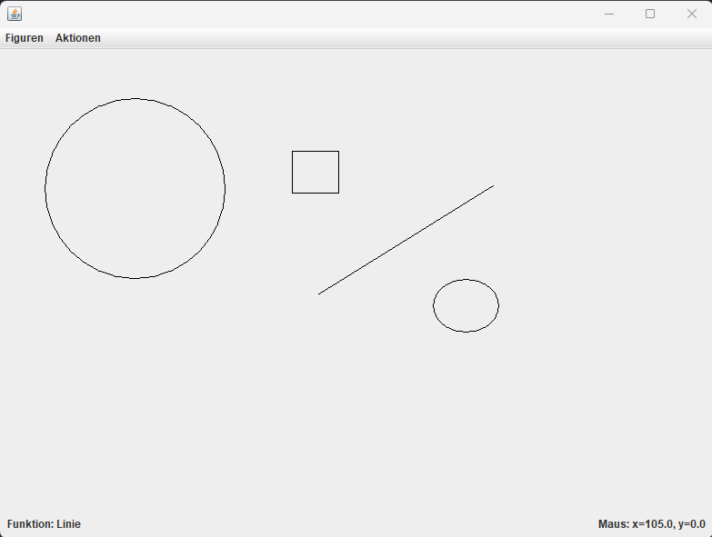

# Grafikeditor

## Beschreibung
Dieses Java-Projekt wurde im Rahmen des Moduls 226 an der Berufschule Gibb erstellt. Der Grafikeditor ermöglicht es Benutzern, einfache Grafiken zu erstellen, zu speichern und zu laden.

## Funktionen
- Zeichnen von Linien, Rechtecken, Kreisen und Ellipsen
- Speichern, Löschen und Laden von Grafiken in verschiedenen Formaten

## Verwendete Technologien
- Java Swing für die Benutzeroberfläche
- Dateioperationen für das Speichern und Laden von Grafiken mit JSON

## Installation
1. Klone das Repository: `git clone https://github.com/DeinBenutzername/Grafikeditor.git`
2. Navigiere in das Verzeichnis: `cd Grafikeditor`
3. Kompiliere das Programm: `javac Grafikeditor.java`
4. Starte den Grafikeditor: `java Grafikeditor`

## Benutzung
- Wähle `Figuren` aus der Werkzeugleiste aus
- Ziehe mit der Maus, um Objekte zu zeichnen
- Verwende die `Aktionen` für weitere Funktionen

## Beispiel

## Copyright
© 2024 Denny Marti. Alle Rechte vorbehalten.